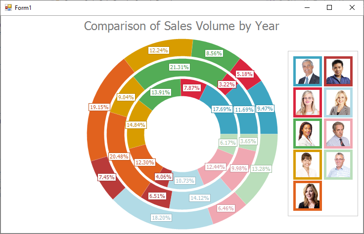

<!-- default badges list -->

<!-- default badges end -->

# Chart for WinForms - Draw a Custom Legend Marker for a Series Point

This example demonstrates how to use the [CustomDrawSeriesPoint](https://docs.devexpress.com/WindowsForms/DevExpress.XtraCharts.ChartControl.CustomDrawSeriesPoint?v=22.2&p=netframework) event to modify the legend markers of nested donut series points.

Assign a custom legend marker to the [LegendMarkerImage](https://docs.devexpress.com/CoreLibraries/2407/cross-platform-core-libraries?v=22.2) property. Set the [DisposeLegendMarkerImage](https://docs.devexpress.com/CoreLibraries/2407/cross-platform-core-libraries?v=22.2) property to `true` to avoid memory leaks. To customize options used to draw the series point, cast [e.SeriesDrawOptions](https://docs.devexpress.com/CoreLibraries/2407/cross-platform-core-libraries?v=22.2) to the
[DrawOptions](https://docs.devexpress.com/CoreLibraries/DevExpress.XtraCharts.DrawOptions?v=22.2) class descendant that stores draw options of the required series view type.

## Files to Review 

* **[Form1.cs](./CS/CustomSeriesPointDrawingSample/Form1.cs) (VB: [Form1.vb](./VB/CustomSeriesPointDrawingSample/Form1.vb))**
* [Employee.cs](./CS/CustomSeriesPointDrawingSample/Model/Employee.cs) (VB: [Employee.vb](./VB/CustomSeriesPointDrawingSample/Model/Employee.vb))
* [NwindDbContext.cs](./CS/CustomSeriesPointDrawingSample/Model/NwindDbContext.cs) (VB: [NwindDbContext.vb](./VB/CustomSeriesPointDrawingSample/Model/NwindDbContext.vb))
* [Order.cs](./CS/CustomSeriesPointDrawingSample/Model/Order.cs) (VB: [Order.vb](./VB/CustomSeriesPointDrawingSample/Model/Order.vb))

## Documentation

[Legend Marker](https://docs.devexpress.com/WindowsForms/1985/controls-and-libraries/chart-control/visual-elements/legend-marker?p=netframework)

## More Examples 

- [Chart for WinForms - How to Add Images for Legend Items](https://github.com/DevExpress-Examples/how-to-provide-images-for-legend-items-e2123)
- [Chart for WinForms - Draw a Custom Legend Marker for a Series](https://github.com/DevExpress-Examples/winforms-chart-draw-a-custom-legend-marker-for-a-series)

<!-- feedback -->
## Does this example address your development requirements/objectives?

 

(you will be redirected to DevExpress.com to submit your response)
<!-- feedback end -->
